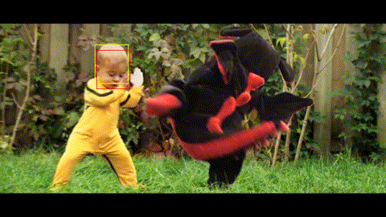
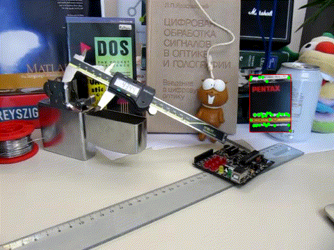

# tracking
Implementations of simple Lucas-Kanade and mean shift trackers.

## Run

- Change settings in the `arguments` file.
- Provide the arguments file to run the app: `tracking arguments`.
- Change between trackers with `SPACE`, the bounding box of the previous frame will be used.
- When running without ground truth data press `F` to select a new base bounding box from the current frame.
- Close with `ESC`.

## Setup

### Windows
- Get [vcpkg](https://github.com/Microsoft/vcpkg)
- Run `.\vcpkg.exe install opencv[contrib]`
- Provide toolchain to cmake `-DCMAKE_TOOLCHAIN_FILE=<path-to-vcpkg>/scripts/buildsystems/vcpkg.cmake`

## Examples

Mean shift tracker on the `DragonBaby` data set:

Lucas-Kanade tracker on the `Box` data set:

## Datasets

Datasets with ground truth data may be taken from [Yi Wu, Jongwoo Lim, and Ming-Hsuan Yang. Online object tracking: A benchmark. In Proceedings of the IEEE conference on computer vision and pattern recognition, pages 2411–2418, 2013.](http://cvlab.hanyang.ac.kr/tracker_benchmark/index.html)
